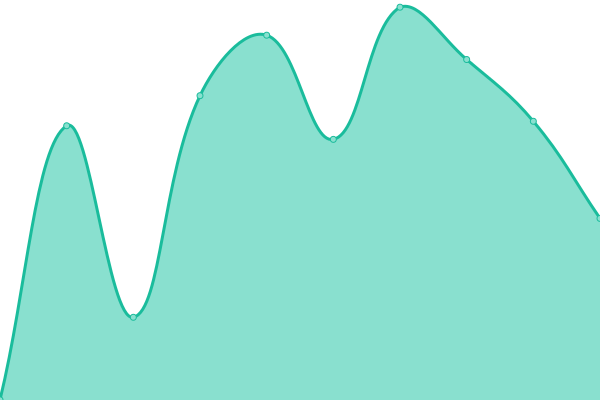
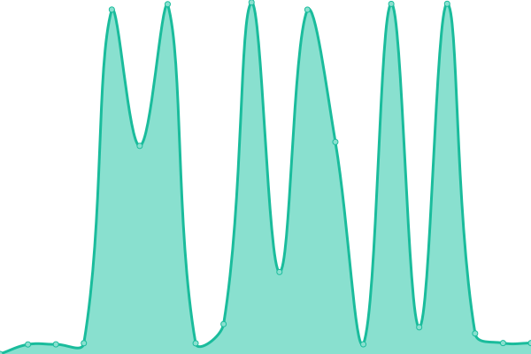

# [📈 Live Status](https://status.solayf.com): <!--live status--> **🟩 All systems operational**

This repository contains the open-source uptime monitor and status page for [SOLAY](https://status.solayf.com), powered by [Upptime](https://github.com/upptime/upptime).

With [Upptime](https://upptime.js.org), you can get your own unlimited and free uptime monitor and status page, powered entirely by a GitHub repository. We use [Issues](https://github.com/solayff/SOLAY_Status/issues) as incident reports, [Actions](https://github.com/solayff/SOLAY_Status/actions) as uptime monitors, and [Pages](https://status.solayf.com) for the status page.

<!--start: status pages-->
<!-- This summary is generated by Upptime (https://github.com/upptime/upptime) -->
<!-- Do not edit this manually, your changes will be overwritten -->
<!-- prettier-ignore -->
| URL | Status | History | Response Time | Uptime |
| --- | ------ | ------- | ------------- | ------ |
|  [SOLAY Website](https://solayf.com) | 🟩 Up | [solay-website.yml](https://github.com/solayff/SOLAY_Status/commits/HEAD/history/solay-website.yml) | 

 1633ms
     
 | 

<a href="https://status.solayf.com/history/solay-website">99.85%</a>
    

|  [SOLAY Games](https://sogames.solayf.com/api/health) | 🟩 Up | [solay-games.yml](https://github.com/solayff/SOLAY_Status/commits/HEAD/history/solay-games.yml) | 

 523ms
     
 | 

<a href="https://status.solayf.com/history/solay-games">100.00%</a>
    

|  [Fivem Server](https://solayf.com/fivem) | 🟩 Up | [fivem-server.yml](https://github.com/solayff/SOLAY_Status/commits/HEAD/history/fivem-server.yml) | 

 226ms
     
 | 

<a href="https://status.solayf.com/history/fivem-server">99.85%</a>
    

<!--end: status pages-->

[**Visit our status website →**](https://status.solayf.com)

## 📄 License

- Powered by: [Upptime](https://github.com/upptime/upptime)
- Code: [MIT](./LICENSE) © [Anand Chowdhary](https://anandchowdhary.com), supported by [Pabio](https://pabio.com)
- Data in the `./history` directory: [Open Database License](https://opendatacommons.org/licenses/odbl/1-0/)
